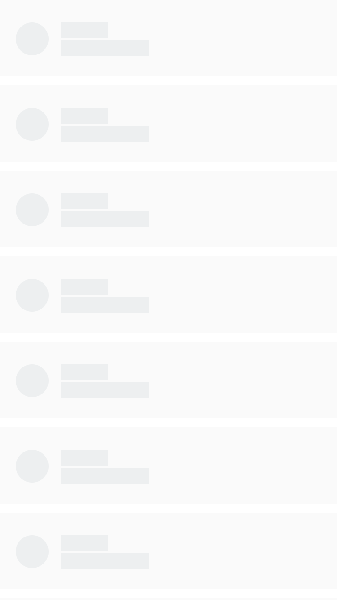

<h1 align="center"> SVG-Skeleton </h1>

## 为什么使用

骨骼屏我们都并不陌生，而骨骼屏的最大的存在意义是 由于页面渲染出内容的时间较长，而使用它在页面上占位，让用户感知白屏的时间减少。

若骨骼屏依赖 React / Vue 等核心框架的时候，必然先需要解析核心库，才到骨骼屏的渲染，这样无疑不是最佳选择。

**SVG-Skeleton** 正是我们一直所期望的方案的实现。

通过 SVG 元素去描述去骨骼图的占位元素，支持 JSX 让编写 SVG 无差别化，复用 SVG 片段，类组件化模式。

## 安装

```sh
npm i svg-skeleton --save
```

或者

```html
<script src="https://cdn.jsdelivr.net/npm/svg-skeleton/dist/svg-skeleton.min.js"></script>
```

## 简单使用

```js
import SVGSkeleton from 'svg-skeleton';

const { h, render } = SVGSkeleton;

const Item = (
    <svg width="750" height="170">
        <rect width="750" height="170" x="0" y="0" fill="#fafafa" rx="0" ry="0"/>
        <circle cx="71.5" cy="86.5" r="36.5" fill="#edeff0"/>
        <rect width="106" height="35" x="135" y="50" fill="#edeff0" rx="0" ry="0"/>
        <rect width="196" height="35" x="135" y="90" fill="#edeff0" rx="0" ry="0"/>
    </svg>
);

const Page = ( ( ) => {
    let List = [ ];

    for ( let i = 0; i < 10; i++ ) {
        List.push( ( <Item y={ i == 0 ? 0 : i * ( 170 + 20 ) } /> ) );
    }

    return (
        <svg width="750" height="1334">
            { List }
        </svg>
    );
} )( );

render( Page,  document.body );
```




## 许可

[MIT](./LICENSE)
